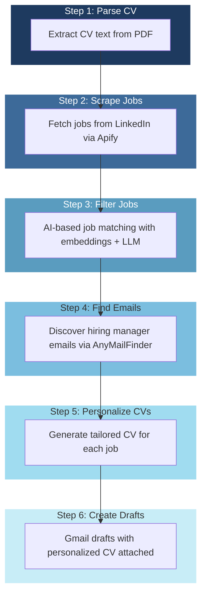

# Email Application Automation

AI-driven pipeline that automates the entire job application process: from discovering jobs to creating personalized CVs and Gmail drafts.

## 📊 Workflow Diagram



---

## 📋 Prerequisites

| Requirement | Description |
|-------------|--------------|
| **Python** | 3.11 or higher |
| **Ollama** | For local LLM (optional, can use OpenAI) |
| **Google Cloud Account** | For Gmail API OAuth2 |
| **Apify Account** | For LinkedIn job scraping |
| **AnyMailFinder Account** | For email discovery |

### Install Dependencies

```bash
pip install -e .
```

---

## ⚙️ Configuration

### 1. Copy Configuration Files

```bash
cp config.example.yaml config.yaml
cp .env.example .env
```

### 2. Configure `config.yaml`

```yaml
# Job search configuration
search:
  urls:
    # LinkedIn job search URLs (use incognito/logged-out URLs)
    - "https://www.linkedin.com/jobs/search/?keywords=front-end%20developer&location=Latin%20America"
  count: 50

# Your CV file
cv:
  path: "./my_cv.pdf"

# LLM Configuration
llm:
  provider: "local"        # "local" (Ollama) or "openai"
  model: "qwen2.5:7b"     # Local: qwen2.5:7b, llama3.2 | OpenAI: gpt-4o-mini
  base_url: "http://localhost:11434/v1"
  api_key: "ollama"       # Use OPENAI_API_KEY for OpenAI

# Filter thresholds
filter:
  embedding_shortlist_size: 50
  llm_fit_threshold: 20
  embedding_model: "nomic-embed-text"
  scoring_model: "llama3.2"

# Email finder
email_finder:
  provider: "anymailfinder"
  max_domain_attempts: 3
  fallback_enabled: true
```

### 3. Configure `.env`

```bash
# Apify (Required - for job scraping)
APIFY_API_KEY=apify_api_XXXXXXXXXXXXXXXXXXXX

# AnyMailFinder (Required - for email discovery)
ANYMAILFINDER_API_KEY=XXXXXXXXXXXXXXXXXXXX

# OpenAI (Optional - only if using provider: "openai")
OPENAI_API_KEY=sk-XXXXXXXXXXXXXXXXXXXXXXXXXXXXXX
```

---

## 🔐 Gmail OAuth Setup

The pipeline uses OAuth2 to create Gmail drafts. This requires credentials from Google Cloud Console.

### Step-by-Step Setup

#### 1. Create Google Cloud Project

1. Go to [Google Cloud Console](https://console.cloud.google.com/)
2. Click **New Project** → name it (e.g., "Email Automation")
3. Click **Create**

#### 2. Enable Gmail API

1. Go to **APIs & Services** → **Library**
2. Search for **Gmail API**
3. Click on it and click **Enable**

#### 3. Configure OAuth Consent Screen

1. Go to **APIs & Services** → **OAuth consent screen**
2. Select **External**
3. Fill in:
   - **App name**: Email Application Automation
   - **User support email**: Your Google account email
4. Click **Save and Continue** through the remaining steps

#### 4. Create OAuth Credentials

1. Go to **APIs & Services** → **Credentials**
2. Click **Create Credentials** → **OAuth client ID**
3. Select **Desktop application**
4. Name it (e.g., "Desktop Client")
5. Click **Create**
6. Click **Download JSON** next to your new credentials

#### 5. Place Credentials

1. Rename the downloaded file to `credentials.json`
2. Place it in the project root directory (same level as `config.yaml`)
3. The first time you run the pipeline, it will open a browser window for you to authorize

---

## 🎨 CV Template Personalization

The CV template is located at `src/app/templates/cv_template.html`.

### What You Can Customize

| Element | How to Modify |
|---------|---------------|
| **Colors** | Change CSS variables at the top: `--primary`, `--accent` |
| **Fonts** | Modify `font-family` in body selector |
| **Layout** | Adjust margins, padding, section spacing |
| **Sections** | Add/remove/modify HTML blocks |
| **Styles** | Edit any CSS properties |

### Variable Reference

The template uses these Jinja2 variables:

```
{{ name }}              - Candidate name
{{ cv_title }}          - Job title
{{ location }}          - Location
{{ phone }}             - Phone number
{{ email }}             - Email address
{{ linkedin }}          - LinkedIn username
{{ languages }}         - Language skills
{{ tailored_summary }}  - AI-generated summary
{{ tailored_skills }}  - AI-matched skills
{{ experience }}       - Job entries (loop)
{{ projects }}          - Projects (loop)
{{ certifications }}    - Certifications (loop)
{{ education }}         - Education (loop)
{{ teaching }}          - Teaching experience (loop)
```

---

## 🚀 Running the Pipeline

### Full Pipeline

```bash
python -m app
```

### Run Individual Steps

Use `--step N` to start from a specific step:

| Step | Command | Description |
|------|---------|--------------|
| 1 | `python -m app --step 1` | Parse CV only |
| 2 | `python -m app --step 2` | Scrape jobs (uses cached CV) |
| 3 | `python -m app --step 3` | Filter jobs |
| 4 | `python -m app --step 4` | Find emails |
| 5 | `python -m app --step 5` | Personalize CVs |
| 6 | `python -m app --step 6` | Create Gmail drafts |

### Useful Options

```bash
# Dry run (skip external API calls)
python -m app --dry-run

# Force re-run (ignore cache)
python -m app --force

# Filter only (stop after step 3)
python -m app --step 3 --filter-only

# Limit number of jobs for testing
python -m app --limit 10

# Custom config file
python -m app --config my_config.yaml
```

### Step-by-Step Workflow

#### Step 1: Parse Your CV

```bash
python -m app --step 1
```

- Input: `my_cv.pdf` (or configured path)
- Output: `data/cv_parsed.json`

#### Step 2: Scrape Jobs

```bash
python -m app --step 2
```

- Input: LinkedIn URLs from config
- Output: `data/apify_results.json`

#### Step 3: Filter Jobs

```bash
python -m app --step 3
```

- Uses two-stage filtering:
  1. **Embedding-based**: Fast similarity matching
  2. **LLM-based**: Detailed relevance scoring
- Output: `data/filtered_jobs.json`

#### Step 4: Find Emails

```bash
python -m app --step 4
```

- Queries AnyMailFinder API for each company
- Output: `data/emails.json`

#### Step 5: Personalize CVs

```bash
python -m app --step 5
```

- Generates individualized CVs for each qualifying job
- Uses LLM to tailor content to job requirements
- Output: `data/cvs/{job_id}/personalized_cv.pdf`

#### Step 6: Create Gmail Drafts

```bash
python -m app --step 6
```

- Creates drafts in your Gmail with:
  - Personalized email body
  - Tailored CV as PDF attachment
- Output: Drafts appear in your Gmail "Drafts" folder

---

## 📁 Project Structure

```
email-application-automation/
├── .env                    # API keys (gitignored)
├── .env.example            # Example env file
├── config.yaml             # Main configuration
├── config.example.yaml     # Example config
├── pyproject.toml          # Python dependencies
├── README.md               # This file
│
├── src/app/
│   ├── __main__.py         # CLI entry point
│   ├── agent.py            # Pipeline orchestrator
│   ├── config.py           # Configuration loader
│   ├── models.py           # Data models
│   │
│   ├── templates/
│   │   └── cv_template.html    # CV HTML template
│   │
│   └── tools/
│       ├── cv_parser.py        # Parse CV PDF
│       ├── scraper.py          # Apify job scraping
│       ├── filter.py           # Job filtering
│       ├── email_finder.py     # Email discovery
│       ├── cv_personalizer.py # Generate tailored CVs
│       ├── gmail_draft.py      # Create Gmail drafts
│       └── ...
│
├── data/                   # Generated data (gitignored)
│   ├── cv_parsed.json
│   ├── apify_results.json
│   ├── filtered_jobs.json
│   ├── emails.json
│   └── cvs/
│       └── {job_id}/
│           ├── personalized_cv.pdf
│           └── email.json
│
└── my_cv.pdf              # Your CV (rename as needed)
```

---

## 🔧 Troubleshooting

### "CV not found" error

- Ensure your CV path in `config.yaml` is correct
- Default: `./my_cv.pdf`

### Gmail OAuth not working

1. Verify `credentials.json` is in project root
2. Check OAuth consent screen is configured
3. Delete `data/gmail_token.json` and re-run to trigger re-authentication

### Ollama connection errors

- Ensure Ollama is running: `ollama serve`
- Verify model is installed: `ollama list`
- Check base_url in config (default: `http://localhost:11434/v1`)

### Jobs not being found

- Verify Apify API key in `.env`
- Check LinkedIn URLs are from incognito (not logged-in)
- Try different search queries

### Filter is too strict/lenient

Adjust in `config.yaml`:
```yaml
filter:
  embedding_shortlist_size: 50   # Increase for more candidates
  llm_fit_threshold: 20           # Lower for more lenient filtering
```

### Out of memory with LLM

- Use smaller models: `qwen2.5:7b` or `llama3.2:3b`
- Or switch to OpenAI for cloud processing

---

## 📝 License

MIT License - Customize freely for your own job search workflow.