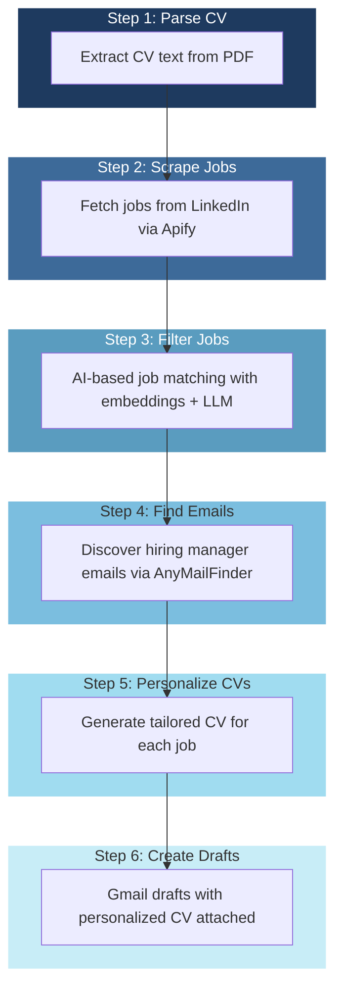

# Email Application Automation

AI-driven pipeline that automates the entire job application process. It searches LinkedIn for relevant jobs, filters them using AI, finds hiring manager emails, generates personalized CVs for each position, and creates ready-to-review Gmail drafts with personalized messages and your tailored CV attached - all you have to do is check and click send.

> **💰 Almost Free** - The pipeline itself and all AI/LLM (via Ollama) are free. You only pay for optional APIs: Apify for scraping, AnyMailFinder for email discovery. **DuckDuckGo fallback is free** - if you run out of AnyMailFinder credits, the pipeline automatically uses web search to find emails at no cost.

## 📊 Workflow Diagram



> **Why Step 1 matters:** Your parsed CV text is used in **Step 3 (Filtering)** to compare against job descriptions using AI embeddings and LLM scoring, AND in **Step 5 (Personalize CV)** to generate tailored summaries and reorder skills for each job. Without parsing your CV first, none of the AI-powered steps work!

---

## 📋 Prerequisites

| Requirement | Description |
|-------------|--------------|
| **Python** | 3.11 or higher |
| **Ollama** | For local LLM (optional, can use OpenAI) |
| **Google Cloud Account** | For Gmail API OAuth2 |
| **Apify Account** | For LinkedIn job scraping |
| **AnyMailFinder Account** | For primary email discovery (paid) |
| **DuckDuckGo** | Free fallback for email search (no setup needed) |

### Install & Configure Ollama

Ollama runs AI models locally - completely free. Install it from [ollama.ai](https://ollama.ai), then pull the models you need:

```bash
# Pull recommended models
ollama pull qwen2.5:7b        # Main LLM (fast, good quality)
ollama pull llama3.2:3b      # For job scoring/filtering
ollama pull nomic-embed-text # For embedding similarity

# Verify installed models
ollama list
```

**Recommended Models:**

| Model | Size | Use Case | RAM |
|-------|------|----------|-----|
| `qwen2.5:7b` | ~5GB | Main LLM for CV tailoring, email generation | 8GB |
| `llama3.2:3b` | ~2GB | Job filtering/scoring (faster, cheaper) | 4GB |
| `nomic-embed-text` | ~274MB | Embedding similarity for job pre-filtering | 1GB |

**To use Ollama:**
1. Run `ollama serve` in background (or it starts automatically)
2. The pipeline connects to `http://localhost:11434/v1` by default
3. Configure in `config.yaml` if you use a different port or model

**Alternative: OpenAI**
If you prefer cloud-based LLM instead of local Ollama, set in `config.yaml`:
```yaml
llm:
  provider: "openai"
  model: "gpt-4o-mini"
  api_key: "${OPENAI_API_KEY}"  # Set in .env
```

### Install Dependencies

```bash
pip install -e .
```

---

## ⚙️ Configuration

### 1. Copy Configuration Files

```bash
cp config.example.yaml config.yaml
cp .env.example .env
```

### 2. Configure `config.yaml`

```yaml
# Job search configuration
search:
  urls:
    # LinkedIn job search URLs (use incognito/logged-out URLs)
    - "https://www.linkedin.com/jobs/search/?keywords=front-end%20developer&location=Latin%20America"
  count: 50

# Your CV file
cv:
  path: "./my_cv.pdf"

# LLM Configuration
llm:
  provider: "local"        # "local" (Ollama) or "openai"
  model: "qwen2.5:7b"     # Local: qwen2.5:7b, llama3.2 | OpenAI: gpt-4o-mini
  base_url: "http://localhost:11434/v1"
  api_key: "ollama"       # Use OPENAI_API_KEY for OpenAI

# Filter thresholds
filter:
  embedding_shortlist_size: 50
  llm_fit_threshold: 20
  embedding_model: "nomic-embed-text"
  scoring_model: "llama3.2"

# Email finder
email_finder:
  provider: "anymailfinder"
  max_domain_attempts: 3
  fallback_enabled: true
```

### 3. Configure `.env`

```bash
# Apify (Required - for job scraping)
APIFY_API_KEY=apify_api_XXXXXXXXXXXXXXXXXXXX

# AnyMailFinder (Primary - for email discovery)
ANYMAILFINDER_API_KEY=XXXXXXXXXXXXXXXXXXXX

# DuckDuckGo fallback (free - no API key needed)
# The pipeline automatically falls back to web search if AnyMailFinder fails or runs out of credits
# No configuration needed - it just works!

# OpenAI (Optional - only if using provider: "openai")
OPENAI_API_KEY=sk-XXXXXXXXXXXXXXXXXXXXXXXXXXXXXX
```

---

## 🔐 Gmail OAuth Setup

The pipeline uses OAuth2 to create Gmail drafts. This requires credentials from Google Cloud Console.

### Step-by-Step Setup

#### 1. Create Google Cloud Project

1. Go to [Google Cloud Console](https://console.cloud.google.com/)
2. Click **New Project** → name it (e.g., "Email Automation")
3. Click **Create**

#### 2. Enable Gmail API

1. Go to **APIs & Services** → **Library**
2. Search for **Gmail API**
3. Click on it and click **Enable**

#### 3. Configure OAuth Consent Screen

1. Go to **APIs & Services** → **OAuth consent screen**
2. Select **External**
3. Fill in:
   - **App name**: Email Application Automation
   - **User support email**: Your Google account email
4. Click **Save and Continue** through the remaining steps
5. In OAuth consent screen, scroll down to **Test users**
6. Click **Add users** and add your Google account email (required for draft creation to work)

#### 4. Add Scopes

1. Go to [https://console.cloud.google.com/auth/scopes](https://console.cloud.google.com/auth/scopes)
2. Click **Add or remove scopes**
3. Check: `https://www.googleapis.com/auth/gmail.compose` (See your emails and compose/send emails from your mailbox)

#### 5. Create OAuth Credentials

1. Go to **APIs & Services** → **Credentials**
2. Click **Create Credentials** → **OAuth client ID**
3. Select **Desktop application**
4. Name it (e.g., "Desktop Client")
5. Click **Create**
6. Click **Download JSON** next to your new credentials

#### 6. Place Credentials

1. Rename the downloaded file to `credentials.json`
2. Place it in the project root directory (same level as `config.yaml`)
3. The first time you run the pipeline, it will open a browser window for you to authorize

---

## 📄 Your CV File

The pipeline needs your CV to work. By default it looks for `my_cv.pdf`, but you can use either PDF or TXT format.

### To use your own CV:

1. **Place your CV file in the project root** (next to `config.yaml`)
2. **Update `config.yaml`** to point to your file:
   ```yaml
   cv:
     path: "./my_cv.pdf"    # Use this if your file is my_cv.pdf
     # path: "./cv.txt"    # Use this if your file is cv.txt
   ```

### ⚠️ PDF Not Working? Use TXT Instead

If you get errors like "model does not support pdf input" or the text extraction returns empty/garbage, switch to text format.

This is common when:
- Your PDF is a **scanned image** (not text-based)
- Your PDF is **password protected**
- The PDF has **complex formatting** that doesn't extract well

**Solution:**
1. Open your CV in any text editor or Google Docs
2. Copy all text content
3. Paste into a new file named `cv.txt`
4. Make sure it follows this structure:
   ```
   YOUR NAME
   YOUR JOB TITLE
   Location: ... Phone: ... Email: ... LinkedIn: ...
   
   About
   Your professional summary here...
   
   Tech Stack
   Frontend: ...
   Backend: ...
   
   Experience
   Job Title - Company
   Date
   - Achievement 1
   - Achievement 2
   
   Education
   Your degree details
   ```
5. Update config.yaml: `path: "./cv.txt"`

**Tip:** An example CV format is in `cv.txt` in the project root - copy that structure for best results.

---

## 🎨 CV Template Personalization

The CV template is located at `src/app/templates/cv_template.html`.

### What You Can Customize

| Element | How to Modify |
|---------|---------------|
| **Colors** | Change CSS variables at the top: `--primary`, `--accent` |
| **Fonts** | Modify `font-family` in body selector |
| **Layout** | Adjust margins, padding, section spacing |
| **Sections** | Add/remove/modify HTML blocks |
| **Styles** | Edit any CSS properties |

### Variable Reference

The template uses these Jinja2 variables:

```
{{ name }}              - Candidate name
{{ cv_title }}          - Job title
{{ location }}          - Location
{{ phone }}             - Phone number
{{ email }}             - Email address
{{ linkedin }}          - LinkedIn username
{{ languages }}         - Language skills
{{ tailored_summary }}  - AI-generated summary
{{ tailored_skills }}  - AI-matched skills
{{ experience }}       - Job entries (loop)
{{ projects }}          - Projects (loop)
{{ certifications }}    - Certifications (loop)
{{ education }}         - Education (loop)
{{ teaching }}          - Teaching experience (loop)
```

---

## 🚀 Running the Pipeline

### Full Pipeline (All Steps 1-6)

```bash
source .venv/bin/activate && PYTHONPATH=src python3 -m app
```

Runs all steps sequentially: Parse CV → Scrape Jobs → Filter Jobs → Find Emails → Personalize CVs → Create Gmail Drafts.

### Useful Options

```bash
# Dry run (skip external API calls)
source .venv/bin/activate && PYTHONPATH=src python3 -m app --dry-run

# Use cached data (skip completed steps, resume from where left off)
source .venv/bin/activate && PYTHONPATH=src python3 -m app --cached

# Force re-run (ignore cache and redo everything)
source .venv/bin/activate && PYTHONPATH=src python3 -m app --force

# Run specific step only
source .venv/bin/activate && PYTHONPATH=src python3 -m app --step 3

# Limit number of jobs for testing
source .venv/bin/activate && PYTHONPATH=src python3 -m app --limit 10

# Custom config file
source .venv/bin/activate && PYTHONPATH=src python3 -m app --config my_config.yaml
```

### Run Individual Steps

Each step runs in isolation — it loads cached data from previous steps automatically.

**Why this format?**
- `source .venv/bin/activate` — Activates your Python virtual environment (or use your specific venv path)
- `PYTHONPATH=src` — Tells Python where to find the `app` module (the code imports from `src/app/`)
- `--step N` — Runs ONLY that step and stops (doesn't run subsequent steps)

| Step | Command | Output File |
|------|---------|-------------|
| 1 | `source .venv/bin/activate && PYTHONPATH=src python3 -m app --step 1` | `data/cv_parsed.json` |
| 2 | `source .venv/bin/activate && PYTHONPATH=src python3 -m app --step 2` | `data/apify_results.json` |
| 3 | `source .venv/bin/activate && PYTHONPATH=src python3 -m app --step 3` | `data/filtered_jobs.json` |
| 4 | `source .venv/bin/activate && PYTHONPATH=src python3 -m app --step 4` | `data/emails.json` |
| 5 | `source .venv/bin/activate && PYTHONPATH=src python3 -m app --step 5` | `data/cvs/{job_id}/personalized_cv.pdf` |
| 6 | `source .venv/bin/activate && PYTHONPATH=src python3 -m app --step 6` | Gmail drafts (check your Drafts folder) |

### Step-by-Step Workflow

#### Step 1: Parse Your CV

```bash
source .venv/bin/activate && PYTHONPATH=src python3 -m app --step 1
```

- Input: `my_cv.pdf` (or configured path)
- Output: `data/cv_parsed.json`
- What it does: Extracts text from your CV PDF/TXT file

#### Step 2: Scrape Jobs

```bash
source .venv/bin/activate && PYTHONPATH=src python3 -m app --step 2
```

- Input: LinkedIn URLs from config (`config.yaml`)
- Output: `data/apify_results.json`
- What it does: Fetches job listings from LinkedIn via Apify API

#### Step 3: Filter Jobs

```bash
source .venv/bin/activate && PYTHONPATH=src python3 -m app --step 3
```

- Input: `data/apify_results.json`, `data/cv_parsed.json`
- Output: `data/filtered_jobs.json`
- What it does: Uses two-stage filtering:
  1. **Embedding-based**: Fast similarity matching (nomic-embed-text)
  2. **LLM-based**: Detailed relevance scoring (llama3.2)

#### Step 4: Find Emails

```bash
source .venv/bin/activate && PYTHONPATH=src python3 -m app --step 4
```

- Input: `data/filtered_jobs.json`
- Output: `data/emails.json`
- What it does: Finds hiring manager emails via AnyMailFinder API (or DuckDuckGo fallback)

#### Step 5: Personalize CVs

```bash
source .venv/bin/activate && PYTHONPATH=src python3 -m app --step 5
```

- Input: `data/filtered_jobs.json`, `data/cv_parsed.json`, `data/emails.json`
- Output: `data/cvs/{job_id}/personalized_cv.pdf`
- What it does: Generates individualized CVs for each qualifying job using LLM to tailor content

#### Step 6: Create Gmail Drafts

```bash
source .venv/bin/activate && PYTHONPATH=src python3 -m app --step 6
```

- Input: `data/cvs/{job_id}/email.json`, `data/cvs/{job_id}/personalized_cv.pdf`
- Output: Gmail Drafts folder
- What it does: Creates drafts in your Gmail with:
  - Personalized email body
  - Tailored CV as PDF attachment
- Output: Drafts appear in your Gmail "Drafts" folder

---

## 🔧 Customizing for Your Needs

The pipeline is designed to be modular - you can adjust prompts and configurations to fit your specific requirements.

### Filter Prompts (Make filtering more/less strict)

In `src/app/tools/filter.py`:

1. **Adjust embedding shortlist size** - More jobs pass to LLM review:
   ```yaml
   filter:
     embedding_shortlist_size: 50   # Increase to review more jobs
   ```

2. **Change LLM scoring threshold** - Lower = more jobs qualify:
   ```yaml
   filter:
     llm_fit_threshold: 20   # Lower = more lenient, higher = stricter
   ```

3. **Modify the system prompt** - The filter uses a hardcoded system prompt in `filter.py`. You can edit the `SYSTEM_PROMPT` variable to:
   - Add specific technologies to favor/avoid
   - Change seniority preferences
   - Adjust scoring criteria

### CV Personalization

In `src/app/tools/cv_personalizer.py`:

1. **Tailoring prompt** - The `_tailor_for_job()` function calls the LLM to generate:
   - `tailored_summary` - 2-3 sentence summary for the specific job
   - `tailored_skills` - Skills reordered by relevance
   - `cv_title` - Adaptive job title for the CV header
   
   You can modify the system prompt in that function to change how the LLM tailors your CV.

2. **CV parsing** - The `_parse_cv_text()` function uses deterministic regex to parse your cv.txt. If your CV format is different, you may need to adjust the parsing logic.

### Email Composer

In `src/app/tools/email_composer.py`:

- Modify the `compose_email()` function to change the email body template, subject line format, or add/remove sections.

### Search URLs

In `config.yaml`:
- Add more URLs for different job titles, locations, or platforms
- Try different LinkedIn search queries
- Add Indeed, Glassdoor, or other job board URLs (if Apify supports them)

---

## 📁 Project Structure

```
email-application-automation/
├── .env                    # API keys (gitignored)
├── .env.example            # Example env file
├── config.yaml             # Main configuration
├── config.example.yaml     # Example config
├── pyproject.toml          # Python dependencies
├── README.md               # This file
│
├── src/app/
│   ├── __main__.py         # CLI entry point
│   ├── agent.py            # Pipeline orchestrator
│   ├── config.py           # Configuration loader
│   ├── models.py           # Data models
│   │
│   ├── templates/
│   │   └── cv_template.html    # CV HTML template
│   │
│   └── tools/
│       ├── cv_parser.py        # Parse CV PDF
│       ├── scraper.py          # Apify job scraping
│       ├── filter.py           # Job filtering
│       ├── email_finder.py     # Email discovery
│       ├── cv_personalizer.py # Generate tailored CVs
│       ├── gmail_draft.py      # Create Gmail drafts
│       └── ...
│
├── data/                   # Generated data (gitignored)
│   ├── cv_parsed.json
│   ├── apify_results.json
│   ├── filtered_jobs.json
│   ├── emails.json
│   └── cvs/
│       └── {job_id}/
│           ├── personalized_cv.pdf
│           └── email.json
│
├── docs/                      # Development documentation
│   ├── 01-business-case-project-charter.md
│   ├── 02-business-requirements-document.md
│   ├── 03-functional-requirements-document.md
│   ├── 04-software-requirements-specification.md
│   ├── 05-technical-requirements-document.md
│   ├── 06-technical-design-document.md
│   ├── 07-high-level-design.md
│   ├── 08-low-level-design.md
│   └── 09-implementation-plan.md
│
├── my_cv.pdf                  # Your CV (rename as needed)
└── cv.txt                     # Your CV in text format (alternative)
```

> **💡 Development Tip:** The `docs/` folder contains the full project documentation (Business Case, BRD, FRD, SRS, TRD, HLD, LLD). These files are useful when working with AI/agentic coding assistants (like Cursor, Windsurf, Claude Code) - you can paste relevant sections to give the AI better context about the project architecture and design decisions.

---

## 🔧 Troubleshooting

### "CV not found" error

- Ensure your CV path in `config.yaml` is correct
- Default: `./my_cv.pdf`

### Gmail OAuth not working

1. Verify `credentials.json` is in project root
2. Check OAuth consent screen is configured
3. Delete `data/gmail_token.json` and re-run to trigger re-authentication

### Ollama connection errors

- Ensure Ollama is running: `ollama serve`
- Verify model is installed: `ollama list`
- Check base_url in config (default: `http://localhost:11434/v1`)

### Jobs not being found

- Verify Apify API key in `.env`
- Check LinkedIn URLs are from incognito (not logged-in)
- Try different search queries

### Filter is too strict/lenient

The filtering works in two stages:
1. **Embedding filter** - Fast similarity matching, picks top N most relevant jobs
2. **LLM filter** - AI evaluates each candidate in detail

Adjust in `config.yaml`:
```yaml
filter:
  # How many jobs pass from embedding filter to LLM review
  # Higher = more jobs reviewed, slower, but less likely to miss good matches
  # Lower = faster, but might miss good jobs
  embedding_shortlist_size: 50

  # Minimum score (1-100) for LLM to consider a job relevant
  # Higher = only best matches qualify
  # Lower = more jobs qualify, less strict
  llm_fit_threshold: 20
```

### Out of memory with LLM

- Use smaller models: `qwen2.5:7b` or `llama3.2:3b`
- Or switch to OpenAI for cloud processing

---

## 📝 License

MIT License - Customize freely for your own job search workflow.